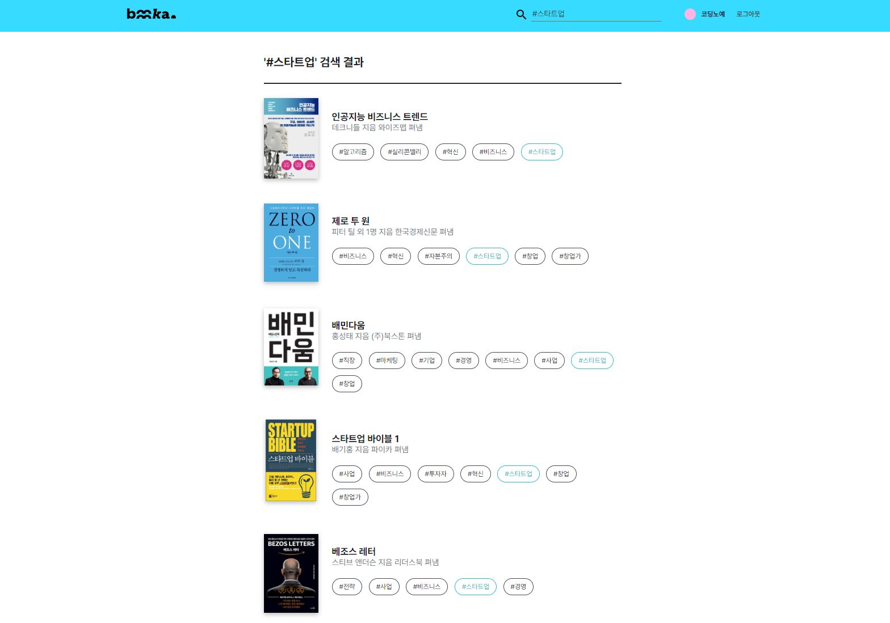

# 📚 BOOKA
어떤 책을 읽으실지 고민되나요? 🤔 **BOOKA에서 추천**받아보세요!

## 📕 프로젝트 소개
유튜브, 넷플릭스 등 OTT서비스의 이용률이 늘어나는데 반해 독서인구는 점점 줄고 있습니다. 독서의 필요성을 느끼는 사람은 많지만 어떤 책을 읽을지 막막해 독서를 시작하지 못하는 경우가 많습니다. 효과적인 추천을 해 줄 수 있다면 독서를 시작하려는 사람들이 책을 선택하는 것을 도울 수 있을 것입니다.

빅데이터를 이용해 **취향에 맞는 책**을 추천하거나 독서 편식을 막기 위한 **새로운 분야의 책**을 추천하여 이 문제를 해결하려 합니다.

BOOKA에서는 KeyBERT를 활용한 **도서 키워드 추출**과 LightGCN을 통한 **평점 예측**을 이용해, 다방면으로 유저에게 도서를 추천하거나 찾을 수 있도록 돕습니다.

## 📙 Abstract
While the utilization rate of OTT services such as YouTube and Netflix is increasing, the reading population is gradually decreasing. Many people feel the need to read, but they often can't start reading because they don't know which book to read. An effective recommendation would help people who want to start reading choose a book.

I'd like to recommend **books that suit your taste using big data** or books in a new field to prevent you from being picky about reading.

BOOKA helps users to recommend or find books in various ways by **extracting book keywords** using KeyBERT and **predicting ratings** through LightGCN.

## 💻 사용해 보기

[http://booka.noye.work](http://booka.noye.work)

## 🎬 시연 영상
(클릭하시면 YouTube로 이동합니다)

 

## 📖 BOOKA

## 📎 설치
[SETUP](https://github.com/kookmin-sw/capstone-2022-27/blob/master/SETUP.md)를 참고해주세요!

## 🧑‍💻👩🏼‍💻 팀원소개

|👑 한창훈|김유진|홍석진|
|-------|----|-----|
||||
|****1688|****1567|****3416|
| | ||
|팀장, DB구축, 서버 개발|웹 프론트, 안드로이드 앱 개발|추천 모델 개발|
